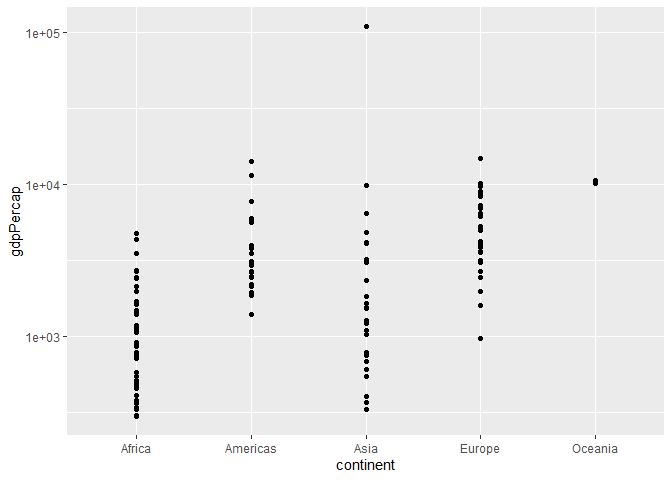

Gapminder
================
(Your name here)
2020-

- [Grading Rubric](#grading-rubric)
  - [Individual](#individual)
  - [Due Date](#due-date)
- [Guided EDA](#guided-eda)
  - [**q0** Perform your “first checks” on the dataset. What variables
    are in this
    dataset?](#q0-perform-your-first-checks-on-the-dataset-what-variables-are-in-this-dataset)
  - [**q1** Determine the most and least recent years in the `gapminder`
    dataset.](#q1-determine-the-most-and-least-recent-years-in-the-gapminder-dataset)
  - [**q2** Filter on years matching `year_min`, and make a plot of the
    GDP per capita against continent. Choose an appropriate `geom_` to
    visualize the data. What observations can you
    make?](#q2-filter-on-years-matching-year_min-and-make-a-plot-of-the-gdp-per-capita-against-continent-choose-an-appropriate-geom_-to-visualize-the-data-what-observations-can-you-make)
  - [**q3** You should have found *at least* three outliers in q2 (but
    possibly many more!). Identify those outliers (figure out which
    countries they
    are).](#q3-you-should-have-found-at-least-three-outliers-in-q2-but-possibly-many-more-identify-those-outliers-figure-out-which-countries-they-are)
  - [**q4** Create a plot similar to yours from q2 studying both
    `year_min` and `year_max`. Find a way to highlight the outliers from
    q3 on your plot *in a way that lets you identify which country is
    which*. Compare the patterns between `year_min` and
    `year_max`.](#q4-create-a-plot-similar-to-yours-from-q2-studying-both-year_min-and-year_max-find-a-way-to-highlight-the-outliers-from-q3-on-your-plot-in-a-way-that-lets-you-identify-which-country-is-which-compare-the-patterns-between-year_min-and-year_max)
- [Your Own EDA](#your-own-eda)
  - [**q5** Create *at least* three new figures below. With each figure,
    try to pose new questions about the
    data.](#q5-create-at-least-three-new-figures-below-with-each-figure-try-to-pose-new-questions-about-the-data)

*Purpose*: Learning to do EDA well takes practice! In this challenge
you’ll further practice EDA by first completing a guided exploration,
then by conducting your own investigation. This challenge will also give
you a chance to use the wide variety of visual tools we’ve been
learning.

<!-- include-rubric -->

# Grading Rubric

<!-- -------------------------------------------------- -->

Unlike exercises, **challenges will be graded**. The following rubrics
define how you will be graded, both on an individual and team basis.

## Individual

<!-- ------------------------- -->

| Category    | Needs Improvement                                                                                                | Satisfactory                                                                                                               |
|-------------|------------------------------------------------------------------------------------------------------------------|----------------------------------------------------------------------------------------------------------------------------|
| Effort      | Some task **q**’s left unattempted                                                                               | All task **q**’s attempted                                                                                                 |
| Observed    | Did not document observations, or observations incorrect                                                         | Documented correct observations based on analysis                                                                          |
| Supported   | Some observations not clearly supported by analysis                                                              | All observations clearly supported by analysis (table, graph, etc.)                                                        |
| Assessed    | Observations include claims not supported by the data, or reflect a level of certainty not warranted by the data | Observations are appropriately qualified by the quality & relevance of the data and (in)conclusiveness of the support      |
| Specified   | Uses the phrase “more data are necessary” without clarification                                                  | Any statement that “more data are necessary” specifies which *specific* data are needed to answer what *specific* question |
| Code Styled | Violations of the [style guide](https://style.tidyverse.org/) hinder readability                                 | Code sufficiently close to the [style guide](https://style.tidyverse.org/)                                                 |

## Due Date

<!-- ------------------------- -->

All the deliverables stated in the rubrics above are due **at midnight**
before the day of the class discussion of the challenge. See the
[Syllabus](https://docs.google.com/document/d/1qeP6DUS8Djq_A0HMllMqsSqX3a9dbcx1/edit?usp=sharing&ouid=110386251748498665069&rtpof=true&sd=true)
for more information.

``` r
library(tidyverse)
```

    ## ── Attaching packages ─────────────────────────────────────── tidyverse 1.3.2 ──
    ## ✔ ggplot2 3.4.0      ✔ purrr   0.3.5 
    ## ✔ tibble  3.1.8      ✔ dplyr   1.0.10
    ## ✔ tidyr   1.2.1      ✔ stringr 1.4.1 
    ## ✔ readr   2.1.3      ✔ forcats 0.5.2 
    ## ── Conflicts ────────────────────────────────────────── tidyverse_conflicts() ──
    ## ✖ dplyr::filter() masks stats::filter()
    ## ✖ dplyr::lag()    masks stats::lag()

``` r
library(gapminder)
```

*Background*: [Gapminder](https://www.gapminder.org/about-gapminder/) is
an independent organization that seeks to educate people about the state
of the world. They seek to counteract the worldview constructed by a
hype-driven media cycle, and promote a “fact-based worldview” by
focusing on data. The dataset we’ll study in this challenge is from
Gapminder.

# Guided EDA

<!-- -------------------------------------------------- -->

First, we’ll go through a round of *guided EDA*. Try to pay attention to
the high-level process we’re going through—after this guided round
you’ll be responsible for doing another cycle of EDA on your own!

### **q0** Perform your “first checks” on the dataset. What variables are in this dataset?

``` r
## TASK: Do your "first checks" here!
gapminder %>% 
  glimpse()
```

    ## Rows: 1,704
    ## Columns: 6
    ## $ country   <fct> "Afghanistan", "Afghanistan", "Afghanistan", "Afghanistan", …
    ## $ continent <fct> Asia, Asia, Asia, Asia, Asia, Asia, Asia, Asia, Asia, Asia, …
    ## $ year      <int> 1952, 1957, 1962, 1967, 1972, 1977, 1982, 1987, 1992, 1997, …
    ## $ lifeExp   <dbl> 28.801, 30.332, 31.997, 34.020, 36.088, 38.438, 39.854, 40.8…
    ## $ pop       <int> 8425333, 9240934, 10267083, 11537966, 13079460, 14880372, 12…
    ## $ gdpPercap <dbl> 779.4453, 820.8530, 853.1007, 836.1971, 739.9811, 786.1134, …

**Observations**:

The variables in this dataset are country, continent, year, lifeExp,
pop, and gdpPercap.

### **q1** Determine the most and least recent years in the `gapminder` dataset.

*Hint*: Use the `pull()` function to get a vector out of a tibble.
(Rather than the `$` notation of base R.)

``` r
## TASK: Find the largest and smallest values of `year` in `gapminder`
year_max <- gapminder %>% 
  pull(year) %>% 
  max()
year_min <- gapminder %>% 
  pull(year) %>% 
  min()
```

Use the following test to check your work.

``` r
## NOTE: No need to change this
assertthat::assert_that(year_max %% 7 == 5)
```

    ## [1] TRUE

``` r
assertthat::assert_that(year_max %% 3 == 0)
```

    ## [1] TRUE

``` r
assertthat::assert_that(year_min %% 7 == 6)
```

    ## [1] TRUE

``` r
assertthat::assert_that(year_min %% 3 == 2)
```

    ## [1] TRUE

``` r
if (is_tibble(year_max)) {
  print("year_max is a tibble; try using `pull()` to get a vector")
  assertthat::assert_that(False)
}

print("Nice!")
```

    ## [1] "Nice!"

### **q2** Filter on years matching `year_min`, and make a plot of the GDP per capita against continent. Choose an appropriate `geom_` to visualize the data. What observations can you make?

You may encounter difficulties in visualizing these data; if so document
your challenges and attempt to produce the most informative visual you
can.

``` r
## TASK: Create a visual of gdpPercap vs continent
gapminder %>% 
  filter(year == year_min) %>% 
  ggplot(aes(x = continent, y = gdpPercap)) +
  geom_point() +
  scale_y_log10()
```

<!-- -->

``` r
gapminder %>% 
  filter(year == year_min) %>% 
  ggplot(aes(x = continent, y = gdpPercap)) +
  geom_boxplot() +
  scale_y_log10()
```

<!-- -->

**Observations**:

Based on the boxplot with the log scale, it appears as though that
Africa and Europe have a slight left skew, while Asia is skewed right,
and the Americas and Oceania have a generally normal distribution.

**Difficulties & Approaches**:

First I visualized the GDP per capita without using a log scale for GDP
per capita, for each continent with a scatterplot. It was not extremely
helpful except for identifying where the outliers occurred,but even
then, we could not say for sure if some of them were actually outliers
or just some maximum values. Then I decided to make boxplots (also
without using the log scale on the y-axis), which gave a little bit more
clarity on the skew of the data, and it also confirmed which points were
outliers and how many outliers for GDP per capita there were for each
continent. However, even with the boxplot, the outliers (particularly
the largest point which occurs in Asia) shrunk the rest of the plot so
it was still somewhat difficult to discern the GDP per capita
distribution for a continent.

However, switching to a log scale made reading the data significantly
easier and allowed me to make more accurate observations.

### **q3** You should have found *at least* three outliers in q2 (but possibly many more!). Identify those outliers (figure out which countries they are).

``` r
## TASK: Identify the outliers from q2
gapminder %>% 
  filter(year == year_min) %>% 
  arrange(desc(gdpPercap)) %>% 
  group_by(continent) %>% 
  slice(1:3)
```

    ## # A tibble: 14 × 6
    ## # Groups:   continent [5]
    ##    country        continent  year lifeExp       pop gdpPercap
    ##    <fct>          <fct>     <int>   <dbl>     <int>     <dbl>
    ##  1 South Africa   Africa     1952    45.0  14264935     4725.
    ##  2 Gabon          Africa     1952    37.0    420702     4293.
    ##  3 Angola         Africa     1952    30.0   4232095     3521.
    ##  4 United States  Americas   1952    68.4 157553000    13990.
    ##  5 Canada         Americas   1952    68.8  14785584    11367.
    ##  6 Venezuela      Americas   1952    55.1   5439568     7690.
    ##  7 Kuwait         Asia       1952    55.6    160000   108382.
    ##  8 Bahrain        Asia       1952    50.9    120447     9867.
    ##  9 Saudi Arabia   Asia       1952    39.9   4005677     6460.
    ## 10 Switzerland    Europe     1952    69.6   4815000    14734.
    ## 11 Norway         Europe     1952    72.7   3327728    10095.
    ## 12 United Kingdom Europe     1952    69.2  50430000     9980.
    ## 13 New Zealand    Oceania    1952    69.4   1994794    10557.
    ## 14 Australia      Oceania    1952    69.1   8691212    10040.

**Observations**:

- Identify the outlier countries from q2

According to the boxplot generated in q2, the top 2 countries in Africa,
the top 3 countries in the Americas, the top 2 countries in Asia, and
the top 1 country in Europe in terms of GDP per capita are outliers.
Based on this, if we extract such information, we obtain South Africa
and Gabon in Africa, the United States, Canada, and Venezuela in the
Americas, Kuwait and Bahrain in Asia, and Switzerland in Europe as the
outliers.

*Hint*: For the next task, it’s helpful to know a ggplot trick we’ll
learn in an upcoming exercise: You can use the `data` argument inside
any `geom_*` to modify the data that will be plotted *by that geom
only*. For instance, you can use this trick to filter a set of points to
label:

``` r
## NOTE: No need to edit, use ideas from this in q4 below
gapminder %>%
  filter(year == max(year)) %>%

  ggplot(aes(continent, lifeExp)) +
  geom_boxplot() +
  geom_point(
    data = . %>% filter(country %in% c("United Kingdom", "Japan", "Zambia")),
    mapping = aes(color = country),
    size = 2
  )
```

<!-- -->

### **q4** Create a plot similar to yours from q2 studying both `year_min` and `year_max`. Find a way to highlight the outliers from q3 on your plot *in a way that lets you identify which country is which*. Compare the patterns between `year_min` and `year_max`.

*Hint*: We’ve learned a lot of different ways to show multiple
variables; think about using different aesthetics or facets.

``` r
## TASK: Create a visual of gdpPercap vs continent
gapminder %>%
  filter(year == year_min | year == year_max) %>%
  ggplot(aes(continent, gdpPercap)) +
  geom_boxplot() +
  geom_point(
    data = . %>% filter(country %in% c("South Africa", "Gabon", "United States", "Canada", 
                                       "Venezuela", "Kuwait", "Bahrain", "Switzerland")),
    mapping = aes(color = country),
    size = 2
  ) +
  facet_wrap(~year)
```

<!-- -->

**Observations**:

The countries that appeared as outliers in 1952 still remained as some
of the top countries in terms of GDP per capita in 2007. In addition,
there is more of a spread in GDP per capita (less overlap) amongst the
outlier countries in 2007 than in 1952, aside from Kuwait which was a
rather extreme outlier in 1952.

# Your Own EDA

<!-- -------------------------------------------------- -->

Now it’s your turn! We just went through guided EDA considering the GDP
per capita at two time points. You can continue looking at outliers,
consider different years, repeat the exercise with `lifeExp`, consider
the relationship between variables, or something else entirely.

### **q5** Create *at least* three new figures below. With each figure, try to pose new questions about the data.

``` r
## TASK: Your first graph
gapminder %>%
  filter(year == year_min | year == year_max) %>%
  ggplot(aes(continent, lifeExp)) +
  geom_boxplot() +
  geom_point(
    data = . %>% filter(country %in% c("South Africa", "Gabon", "United States", "Canada", 
                                       "Venezuela", "Kuwait", "Bahrain", "Switzerland")),
    mapping = aes(color = country),
    size = 2
  ) +
  facet_wrap(~year)
```

<!-- -->

Comparing this boxplot to the one generated in q3, it seems as though
for the most part, the countries identified as outliers for GDP per
capital in 1952 also have a relatively high life expectancy and are in
the top 50% of the data, except for Africa (in particular, Gabon in 1952
and South Africa in 2007).

``` r
## TASK: Your second graph
top_gdpPercap_countries <- gapminder %>% 
  filter(year == year_max) %>% 
  arrange(desc(gdpPercap)) %>% 
  group_by(continent) %>% 
  slice(1:2) %>% 
  pull(country)

gapminder %>% 
  filter(country %in% top_gdpPercap_countries) %>%
  ggplot(aes(x = year, y = gdpPercap)) +
  geom_line(aes(color = country))
```

<!-- -->

The 10 countries shown above represent the top 2 countries with the
highest GDP per capita in each of the 5 continents studied in the
dataset as of 2007. It appears as though most of the countries share a
similar trend of increasing over time, with Kuwait being a rather
obvious outlier in this trend.

``` r
## TASK: Your third graph
top_gdpPercap_countries <- gapminder %>% 
  filter(year == year_max) %>%
  arrange(desc(gdpPercap)) %>% 
  group_by(continent) %>% 
  slice(1:2) %>% 
  pull(country)

gapminder %>% 
  filter(country %in% top_gdpPercap_countries) %>%
  ggplot(aes(x = lifeExp, y = gdpPercap)) +
  geom_point(aes(color = country))
```

<!-- -->

If we compare the GDP per capita and life expectancy of countries, this
time with the top 2 countries with the highest GDP per capita in each of
the 5 continents in the dataset as of 2007, we can see that there is a
generally positive correlation between the two variables, where as the
GDP per capita of a country increases, the life expectancy of its
inhabitants generally seems to increase (except for Kuwait, which is an
outlier in this trend). This makes sense as a greater GDP per capita
might mean better healthcare and overall prosperity of a country, which
might be factors that influence the life expectancy, although we cannot
say that it is a direct cause of increased life expectancy.
