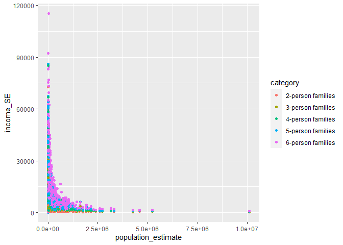
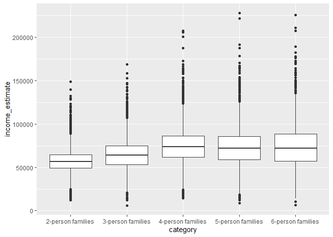

US Income
================
Sreenidhi Chalimadugu
2023-04-09

- [Grading Rubric](#grading-rubric)
  - [Individual](#individual)
  - [Due Date](#due-date)
- [Setup](#setup)
  - [**q1** Load the population data from c06; simply replace
    `filename_pop`
    below.](#q1-load-the-population-data-from-c06-simply-replace-filename_pop-below)
  - [**q2** Obtain median income data from the Census
    Bureau:](#q2-obtain-median-income-data-from-the-census-bureau)
  - [**q3** Tidy the `df_income` dataset by completing the code below.
    Pivot and rename the columns to arrive at the column names
    `id, geographic_area_name, category, income_estimate, income_moe`.](#q3-tidy-the-df_income-dataset-by-completing-the-code-below-pivot-and-rename-the-columns-to-arrive-at-the-column-names-id-geographic_area_name-category-income_estimate-income_moe)
  - [**q4** Convert the margin of error to standard error. Additionally,
    compute a 99% confidence interval on income, and normalize the
    standard error to `income_CV = income_SE / income_estimate`. Provide
    these columns with the names
    `income_SE, income_lo, income_hi, income_CV`.](#q4-convert-the-margin-of-error-to-standard-error-additionally-compute-a-99-confidence-interval-on-income-and-normalize-the-standard-error-to-income_cv--income_se--income_estimate-provide-these-columns-with-the-names-income_se-income_lo-income_hi-income_cv)
  - [**q5** Join `df_q4` and `df_pop`.](#q5-join-df_q4-and-df_pop)
- [Analysis](#analysis)
  - [**q6** Study the following graph, making sure to note what you can
    *and can’t* conclude based on the estimates and confidence
    intervals. Document your observations below and answer the
    questions.](#q6-study-the-following-graph-making-sure-to-note-what-you-can-and-cant-conclude-based-on-the-estimates-and-confidence-intervals-document-your-observations-below-and-answer-the-questions)
  - [**q7** Plot the standard error against population for all counties.
    Create a visual that effectively highlights the trends in the data.
    Answer the questions under *observations*
    below.](#q7-plot-the-standard-error-against-population-for-all-counties-create-a-visual-that-effectively-highlights-the-trends-in-the-data-answer-the-questions-under-observations-below)
- [Going Further](#going-further)
  - [**q8** Pose your own question about the data. Create a
    visualization (or table) here, and document your
    observations.](#q8-pose-your-own-question-about-the-data-create-a-visualization-or-table-here-and-document-your-observations)
- [References](#references)

*Purpose*: We’ve been learning how to quantify uncertainty in estimates
through the exercises; now its time to put those skills to use studying
real data. In this challenge we’ll use concepts like confidence
intervals to help us make sense of census data.

*Reading*: - [Using ACS Estimates and Margin of
Error](https://www.census.gov/programs-surveys/acs/guidance/training-presentations/acs-moe.html)
(Optional) - [Patterns and Causes of Uncertainty in the American
Community
Survey](https://www.sciencedirect.com/science/article/pii/S0143622813002518?casa_token=VddzQ1-spHMAAAAA:FTq92LXgiPVloJUVjnHs8Ma1HwvPigisAYtzfqaGbbRRwoknNq56Y2IzszmGgIGH4JAPzQN0)
(Optional, particularly the *Uncertainty in surveys* section under the
Introduction.)

<!-- include-rubric -->

# Grading Rubric

<!-- -------------------------------------------------- -->

Unlike exercises, **challenges will be graded**. The following rubrics
define how you will be graded, both on an individual and team basis.

## Individual

<!-- ------------------------- -->

| Category    | Needs Improvement                                                                                                | Satisfactory                                                                                                               |
|-------------|------------------------------------------------------------------------------------------------------------------|----------------------------------------------------------------------------------------------------------------------------|
| Effort      | Some task **q**’s left unattempted                                                                               | All task **q**’s attempted                                                                                                 |
| Observed    | Did not document observations, or observations incorrect                                                         | Documented correct observations based on analysis                                                                          |
| Supported   | Some observations not clearly supported by analysis                                                              | All observations clearly supported by analysis (table, graph, etc.)                                                        |
| Assessed    | Observations include claims not supported by the data, or reflect a level of certainty not warranted by the data | Observations are appropriately qualified by the quality & relevance of the data and (in)conclusiveness of the support      |
| Specified   | Uses the phrase “more data are necessary” without clarification                                                  | Any statement that “more data are necessary” specifies which *specific* data are needed to answer what *specific* question |
| Code Styled | Violations of the [style guide](https://style.tidyverse.org/) hinder readability                                 | Code sufficiently close to the [style guide](https://style.tidyverse.org/)                                                 |

## Due Date

<!-- ------------------------- -->

All the deliverables stated in the rubrics above are due **at midnight**
before the day of the class discussion of the challenge. See the
[Syllabus](https://docs.google.com/document/d/1qeP6DUS8Djq_A0HMllMqsSqX3a9dbcx1/edit?usp=sharing&ouid=110386251748498665069&rtpof=true&sd=true)
for more information.

# Setup

<!-- ----------------------------------------------------------------------- -->

``` r
library(tidyverse)
```

    ## ── Attaching packages ─────────────────────────────────────── tidyverse 1.3.2 ──
    ## ✔ ggplot2 3.4.0      ✔ purrr   0.3.5 
    ## ✔ tibble  3.1.8      ✔ dplyr   1.0.10
    ## ✔ tidyr   1.2.1      ✔ stringr 1.4.1 
    ## ✔ readr   2.1.3      ✔ forcats 0.5.2 
    ## ── Conflicts ────────────────────────────────────────── tidyverse_conflicts() ──
    ## ✖ dplyr::filter() masks stats::filter()
    ## ✖ dplyr::lag()    masks stats::lag()

### **q1** Load the population data from c06; simply replace `filename_pop` below.

``` r
## TODO: Give the filename for your copy of Table B01003
filename_pop <- "./data/ACSDT5Y2018.B01003-Data.csv"

## NOTE: No need to edit
df_pop <-
  read_csv(
    filename_pop,
    skip = 2,
    col_names = c(
      "id",
      "geographic_area_name",
      "population_estimate",
      "population_moe"
    )
  )
```

    ## Rows: 3220 Columns: 7
    ## ── Column specification ────────────────────────────────────────────────────────
    ## Delimiter: ","
    ## chr (5): id, geographic_area_name, population_moe, X5, X6
    ## dbl (1): population_estimate
    ## lgl (1): X7
    ## 
    ## ℹ Use `spec()` to retrieve the full column specification for this data.
    ## ℹ Specify the column types or set `show_col_types = FALSE` to quiet this message.

You might wonder why the `Margin of Error` in the population estimates
is listed as `*****`. From the [documentation (PDF
link)](https://www.google.com/url?sa=t&rct=j&q=&esrc=s&source=web&cd=&cad=rja&uact=8&ved=2ahUKEwj81Omy16TrAhXsguAKHTzKDQEQFjABegQIBxAB&url=https%3A%2F%2Fwww2.census.gov%2Fprograms-surveys%2Facs%2Ftech_docs%2Faccuracy%2FMultiyearACSAccuracyofData2018.pdf%3F&usg=AOvVaw2TOrVuBDlkDI2gde6ugce_)
for the ACS:

> If the margin of error is displayed as ‘\*\*\*\*\*’ (five asterisks),
> the estimate has been controlled to be equal to a fixed value and so
> it has no sampling error. A standard error of zero should be used for
> these controlled estimates when completing calculations, such as those
> in the following section.

This means that for cases listed as `*****` the US Census Bureau
recommends treating the margin of error (and thus standard error) as
zero.

### **q2** Obtain median income data from the Census Bureau:

- `Filter > Topics > Income and Poverty > Income and Poverty`
- `Filter > Geography > County > All counties in United States`
- Look for `Median Income in the Past 12 Months` (Table S1903)
- Download the 2018 5-year ACS estimates; save to your `data` folder and
  add the filename below.

``` r
## TODO: Give the filename for your copy of Table S1903
filename_income <- "./data/ACSST5Y2018.S1903-Data.csv"

## NOTE: No need to edit
df_income <-
  read_csv(filename_income, skip = 1) %>% 
  rename("id" = "Geography") %>% 
  select(
    -starts_with("Annotation of Margin of Error"),
    -starts_with("Annotation of Estimate")
  )
```

    ## New names:
    ## • `` -> `...483`

    ## Warning: One or more parsing issues, call `problems()` on your data frame for details,
    ## e.g.:
    ##   dat <- vroom(...)
    ##   problems(dat)

    ## Rows: 3220 Columns: 483
    ## ── Column specification ────────────────────────────────────────────────────────
    ## Delimiter: ","
    ## chr (306): Geography, Geographic Area Name, Annotation of Margin of Error!!N...
    ## dbl (176): Estimate!!Number!!HOUSEHOLD INCOME BY RACE AND HISPANIC OR LATINO...
    ## lgl   (1): ...483
    ## 
    ## ℹ Use `spec()` to retrieve the full column specification for this data.
    ## ℹ Specify the column types or set `show_col_types = FALSE` to quiet this message.

``` r
df_income
```

    ## # A tibble: 3,220 × 243
    ##    id    Geogr…¹ Estim…² Margi…³ Estim…⁴ Margi…⁵ Estim…⁶ Margi…⁷ Estim…⁸ Margi…⁹
    ##    <chr> <chr>     <dbl>   <dbl>   <dbl>   <dbl>   <dbl>   <dbl>   <dbl>   <dbl>
    ##  1 0500… Autaug…   21115     383   16585     363    4085     205      34      33
    ##  2 0500… Baldwi…   78622    1183   69544    1042    6425     500     460     171
    ##  3 0500… Barbou…    9186     280    4729     211    4135     248       9      16
    ##  4 0500… Bibb C…    6840     321    5588     346    1172     200       0      22
    ##  5 0500… Blount…   20600     396   20054     417     190      98      24      27
    ##  6 0500… Bulloc…    3609     196     881     119    2681     212      44      52
    ##  7 0500… Butler…    6708     274    3821     173    2752     207       2       4
    ##  8 0500… Calhou…   45033     683   33820     559    9514     435     152      64
    ##  9 0500… Chambe…   13516     372    7953     296    5268     235      54      42
    ## 10 0500… Cherok…   10606     370    9953     356     477      90      33      32
    ## # … with 3,210 more rows, 233 more variables:
    ## #   `Estimate!!Number!!HOUSEHOLD INCOME BY RACE AND HISPANIC OR LATINO ORIGIN OF HOUSEHOLDER!!Households!!One race--!!Asian` <dbl>,
    ## #   `Margin of Error!!Number MOE!!HOUSEHOLD INCOME BY RACE AND HISPANIC OR LATINO ORIGIN OF HOUSEHOLDER!!Households!!One race--!!Asian` <dbl>,
    ## #   `Estimate!!Number!!HOUSEHOLD INCOME BY RACE AND HISPANIC OR LATINO ORIGIN OF HOUSEHOLDER!!Households!!One race--!!Native Hawaiian and Other Pacific Islander` <dbl>,
    ## #   `Margin of Error!!Number MOE!!HOUSEHOLD INCOME BY RACE AND HISPANIC OR LATINO ORIGIN OF HOUSEHOLDER!!Households!!One race--!!Native Hawaiian and Other Pacific Islander` <dbl>,
    ## #   `Estimate!!Number!!HOUSEHOLD INCOME BY RACE AND HISPANIC OR LATINO ORIGIN OF HOUSEHOLDER!!Households!!One race--!!Some other race` <dbl>,
    ## #   `Margin of Error!!Number MOE!!HOUSEHOLD INCOME BY RACE AND HISPANIC OR LATINO ORIGIN OF HOUSEHOLDER!!Households!!One race--!!Some other race` <dbl>, …

Use the following test to check that you downloaded the correct file:

``` r
## NOTE: No need to edit, use to check you got the right file.
assertthat::assert_that(
  df_income %>%
    filter(id == "0500000US01001") %>%
    pull(`Estimate!!Percent Distribution!!FAMILY INCOME BY FAMILY SIZE!!2-person families`)
  == 45.6
)
```

    ## [1] TRUE

``` r
print("Well done!")
```

    ## [1] "Well done!"

This dataset is in desperate need of some *tidying*. To simplify the
task, we’ll start by considering the `\\d-person families` columns
first.

### **q3** Tidy the `df_income` dataset by completing the code below. Pivot and rename the columns to arrive at the column names `id, geographic_area_name, category, income_estimate, income_moe`.

*Hint*: You can do this in a single pivot using the `".value"` argument
and a `names_pattern` using capture groups `"()"`. Remember that you can
use an OR operator `|` in a regex to allow for multiple possibilities in
a capture group, for example `"(Estimate|Margin of Error)"`.

``` r
df_q3 <-
  df_income %>%
  select(
    id,
    contains("Geographic"),
    contains("median") & matches("\\d-person families")
  ) %>%
  mutate(across(contains("median"), as.numeric)) %>%
## TODO: Pivot the data, rename the columns
  pivot_longer(
    names_pattern = "(Estimate|Margin of Error).*(\\d-person families)",
    names_to = c(".value", 'category'),
    cols = c(-id, -contains("Geographic"))
  ) %>% 
  rename("geographic_area_name" = "Geographic Area Name",
         "income_estimate" = "Estimate", 
         "income_moe" = "Margin of Error" )
```

    ## Warning in mask$eval_all_mutate(quo): NAs introduced by coercion

    ## Warning in mask$eval_all_mutate(quo): NAs introduced by coercion

    ## Warning in mask$eval_all_mutate(quo): NAs introduced by coercion

    ## Warning in mask$eval_all_mutate(quo): NAs introduced by coercion

    ## Warning in mask$eval_all_mutate(quo): NAs introduced by coercion

    ## Warning in mask$eval_all_mutate(quo): NAs introduced by coercion

    ## Warning in mask$eval_all_mutate(quo): NAs introduced by coercion

    ## Warning in mask$eval_all_mutate(quo): NAs introduced by coercion

``` r
df_q3
```

    ## # A tibble: 16,100 × 5
    ##    id             geographic_area_name    category          income_est…¹ incom…²
    ##    <chr>          <chr>                   <chr>                    <dbl>   <dbl>
    ##  1 0500000US01001 Autauga County, Alabama 2-person families        64947    6663
    ##  2 0500000US01001 Autauga County, Alabama 3-person families        80172   14181
    ##  3 0500000US01001 Autauga County, Alabama 4-person families        85455   10692
    ##  4 0500000US01001 Autauga County, Alabama 5-person families        88601   20739
    ##  5 0500000US01001 Autauga County, Alabama 6-person families       103787   12387
    ##  6 0500000US01003 Baldwin County, Alabama 2-person families        63975    2297
    ##  7 0500000US01003 Baldwin County, Alabama 3-person families        79390    8851
    ##  8 0500000US01003 Baldwin County, Alabama 4-person families        88458    5199
    ##  9 0500000US01003 Baldwin County, Alabama 5-person families        91259    7011
    ## 10 0500000US01003 Baldwin County, Alabama 6-person families        69609   23175
    ## # … with 16,090 more rows, and abbreviated variable names ¹​income_estimate,
    ## #   ²​income_moe

Use the following tests to check your work:

``` r
## NOTE: No need to edit
assertthat::assert_that(setequal(
  names(df_q3),
  c("id", "geographic_area_name", "category", "income_estimate", "income_moe")
))
```

    ## [1] TRUE

``` r
assertthat::assert_that(
  df_q3 %>%
    filter(id == "0500000US01001", category == "2-person families") %>%
    pull(income_moe)
  == 6663
)
```

    ## [1] TRUE

``` r
print("Nice!")
```

    ## [1] "Nice!"

The data gives finite values for the Margin of Error, which is closely
related to the Standard Error. The Census Bureau documentation gives the
following relationship between Margin of Error and Standard Error:

$$\text{MOE} = 1.645 \times \text{SE}.$$

### **q4** Convert the margin of error to standard error. Additionally, compute a 99% confidence interval on income, and normalize the standard error to `income_CV = income_SE / income_estimate`. Provide these columns with the names `income_SE, income_lo, income_hi, income_CV`.

``` r
df_q4 <- df_q3 %>% 
  mutate(income_SE = income_moe/1.645) %>% 
  mutate(income_lo = income_estimate - income_SE*2.576) %>% # Multiply by z value
  mutate(income_hi = income_estimate + income_SE*2.576) %>% 
  mutate(income_CV = income_SE/income_estimate)

df_q4
```

    ## # A tibble: 16,100 × 9
    ##    id            geogr…¹ categ…² incom…³ incom…⁴ incom…⁵ incom…⁶ incom…⁷ incom…⁸
    ##    <chr>         <chr>   <chr>     <dbl>   <dbl>   <dbl>   <dbl>   <dbl>   <dbl>
    ##  1 0500000US010… Autaug… 2-pers…   64947    6663   4050.  54513.  75381.  0.0624
    ##  2 0500000US010… Autaug… 3-pers…   80172   14181   8621.  57965. 102379.  0.108 
    ##  3 0500000US010… Autaug… 4-pers…   85455   10692   6500.  68712. 102198.  0.0761
    ##  4 0500000US010… Autaug… 5-pers…   88601   20739  12607.  56125. 121077.  0.142 
    ##  5 0500000US010… Autaug… 6-pers…  103787   12387   7530.  84389. 123185.  0.0726
    ##  6 0500000US010… Baldwi… 2-pers…   63975    2297   1396.  60378.  67572.  0.0218
    ##  7 0500000US010… Baldwi… 3-pers…   79390    8851   5381.  65530.  93250.  0.0678
    ##  8 0500000US010… Baldwi… 4-pers…   88458    5199   3160.  80317.  96599.  0.0357
    ##  9 0500000US010… Baldwi… 5-pers…   91259    7011   4262.  80280. 102238.  0.0467
    ## 10 0500000US010… Baldwi… 6-pers…   69609   23175  14088.  33318. 105900.  0.202 
    ## # … with 16,090 more rows, and abbreviated variable names
    ## #   ¹​geographic_area_name, ²​category, ³​income_estimate, ⁴​income_moe,
    ## #   ⁵​income_SE, ⁶​income_lo, ⁷​income_hi, ⁸​income_CV

Use the following tests to check your work:

``` r
## NOTE: No need to edit
assertthat::assert_that(setequal(
  names(df_q4),
  c("id", "geographic_area_name", "category", "income_estimate", "income_moe",
    "income_SE", "income_lo", "income_hi", "income_CV")
))
```

    ## [1] TRUE

``` r
assertthat::assert_that(
  abs(
    df_q4 %>%
    filter(id == "0500000US01001", category == "2-person families") %>%
    pull(income_SE) - 4050.456
  ) / 4050.456 < 1e-3
)
```

    ## [1] TRUE

``` r
assertthat::assert_that(
  abs(
    df_q4 %>%
    filter(id == "0500000US01001", category == "2-person families") %>%
    pull(income_lo) - 54513.72
  ) / 54513.72 < 1e-3
)
```

    ## [1] TRUE

``` r
assertthat::assert_that(
  abs(
    df_q4 %>%
    filter(id == "0500000US01001", category == "2-person families") %>%
    pull(income_hi) - 75380.28
  ) / 75380.28 < 1e-3
)
```

    ## [1] TRUE

``` r
assertthat::assert_that(
  abs(
    df_q4 %>%
    filter(id == "0500000US01001", category == "2-person families") %>%
    pull(income_CV) - 0.06236556
  ) / 0.06236556 < 1e-3
)
```

    ## [1] TRUE

``` r
print("Nice!")
```

    ## [1] "Nice!"

One last wrangling step: We need to join the two datasets so we can
compare population with income.

### **q5** Join `df_q4` and `df_pop`.

``` r
## TODO: Join df_q4 and df_pop by the appropriate column
df_data <- df_q4 %>%
  left_join(
    df_pop,
    by = "id"
  ) %>% 
  rename("geographic_area_name" = "geographic_area_name.x") %>% 
  select(
    -starts_with("geographic_area_name.y"),
  )

df_data
```

    ## # A tibble: 16,100 × 14
    ##    id    geogr…¹ categ…² incom…³ incom…⁴ incom…⁵ incom…⁶ incom…⁷ incom…⁸ popul…⁹
    ##    <chr> <chr>   <chr>     <dbl>   <dbl>   <dbl>   <dbl>   <dbl>   <dbl>   <dbl>
    ##  1 0500… Autaug… 2-pers…   64947    6663   4050.  54513.  75381.  0.0624   55200
    ##  2 0500… Autaug… 3-pers…   80172   14181   8621.  57965. 102379.  0.108    55200
    ##  3 0500… Autaug… 4-pers…   85455   10692   6500.  68712. 102198.  0.0761   55200
    ##  4 0500… Autaug… 5-pers…   88601   20739  12607.  56125. 121077.  0.142    55200
    ##  5 0500… Autaug… 6-pers…  103787   12387   7530.  84389. 123185.  0.0726   55200
    ##  6 0500… Baldwi… 2-pers…   63975    2297   1396.  60378.  67572.  0.0218  208107
    ##  7 0500… Baldwi… 3-pers…   79390    8851   5381.  65530.  93250.  0.0678  208107
    ##  8 0500… Baldwi… 4-pers…   88458    5199   3160.  80317.  96599.  0.0357  208107
    ##  9 0500… Baldwi… 5-pers…   91259    7011   4262.  80280. 102238.  0.0467  208107
    ## 10 0500… Baldwi… 6-pers…   69609   23175  14088.  33318. 105900.  0.202   208107
    ## # … with 16,090 more rows, 4 more variables: population_moe <chr>, X5 <chr>,
    ## #   X6 <chr>, X7 <lgl>, and abbreviated variable names ¹​geographic_area_name,
    ## #   ²​category, ³​income_estimate, ⁴​income_moe, ⁵​income_SE, ⁶​income_lo,
    ## #   ⁷​income_hi, ⁸​income_CV, ⁹​population_estimate

# Analysis

<!-- ----------------------------------------------------------------------- -->

We now have both estimates and confidence intervals for
`\\d-person families`. Now we can compare cases with quantified
uncertainties: Let’s practice!

### **q6** Study the following graph, making sure to note what you can *and can’t* conclude based on the estimates and confidence intervals. Document your observations below and answer the questions.

``` r
## NOTE: No need to edit; run and inspect
wid <- 0.5

df_data %>%
  filter(str_detect(geographic_area_name, "Massachusetts")) %>%
  mutate(
    county = str_remove(geographic_area_name, " County,.*$"),
    county = fct_reorder(county, income_estimate)
  ) %>%

  ggplot(aes(county, income_estimate, color = category)) +
  geom_errorbar(
    aes(ymin = income_lo, ymax = income_hi),
    position = position_dodge(width = wid)
  ) +
  geom_point(position = position_dodge(width = wid)) +

  coord_flip() +
  labs(
    x = "County",
    y = "Median Household Income"
  )
```

    ## Warning: Removed 2 rows containing missing values (`geom_point()`).

<!-- -->

**Observations**:

- Document your observations here.
  - 2-person families tend to have lower household incomes.
  - In most cases, 2-person families have smaller confidence intervals
    than those of 6-person families.
  - It appears as though the household income is higher if there are
    more people in the family, though this is not necessarily always
    true.
- Can you confidently distinguish between household incomes in Suffolk
  county? Why or why not?
  - No, since the household incomes are very similar and the error bars
    overlap.
- Which counties have the widest confidence intervals?
  - Nantucket and Dukes have the widest intervals.

In the next task you’ll investigate the relationship between population
and uncertainty.

### **q7** Plot the standard error against population for all counties. Create a visual that effectively highlights the trends in the data. Answer the questions under *observations* below.

*Hint*: Remember that standard error is a function of *both* variability
(e.g. variance) and sample size.

``` r
df_data %>% 
  ggplot(aes(population_estimate, income_SE, color = category)) +
  geom_point()
```

    ## Warning: Removed 814 rows containing missing values (`geom_point()`).

<!-- -->

**Observations**:

- What *overall* trend do you see between `SE` and population? Why might
  this trend exist?
  - Overall, the standard error decreases as the population increases,
    which makes sense since a larger set of data that is closer to the
    true population number will generally yield smaller error.
- What does this *overall* trend tell you about the relative ease of
  studying small vs large counties?
  - It would probably be easier to study large counties, since it might
    be easier to find a more representative sample of the county without
    having to choose the population or a large part of it.

# Going Further

<!-- ----------------------------------------------------------------------- -->

Now it’s your turn! You have income data for every county in the United
States: Pose your own question and try to answer it with the data.

### **q8** Pose your own question about the data. Create a visualization (or table) here, and document your observations.

``` r
## TODO: Pose and answer your own question about the data
# How does family size relate to median income in counties around the United States?
df_data %>%  
  ggplot(aes(x = category, y = income_estimate)) + 
  geom_boxplot()
```

    ## Warning: Removed 814 rows containing non-finite values (`stat_boxplot()`).

<!-- -->

**Observations**:

- The 4-person families have the highest median income, while the
  2-person families have the lowest median income.
- The interquartile range is greater for larger families.

Ideas:

- Compare trends across counties that are relevant to you; e.g. places
  you’ve lived, places you’ve been, places in the US that are
  interesting to you.
- In q3 we tidied the median `\\d-person families` columns only.
  - Tidy the other median columns to learn about other people groups.
  - Tidy the percentage columns to learn about how many households of
    each category are in each county.
- Your own idea!

# References

<!-- ----------------------------------------------------------------------- -->

\[1\] Spielman SE, Folch DC, Nagle NN (2014) Patterns and causes of
uncertainty in the American Community Survey. Applied Geography 46:
147–157. <pmid:25404783>
[link](https://www.sciencedirect.com/science/article/pii/S0143622813002518?casa_token=VddzQ1-spHMAAAAA:FTq92LXgiPVloJUVjnHs8Ma1HwvPigisAYtzfqaGbbRRwoknNqZ6Y2IzszmGgIGH4JAPzQN0)
