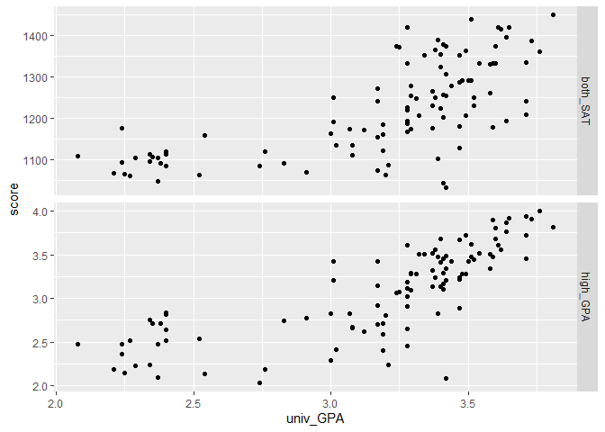
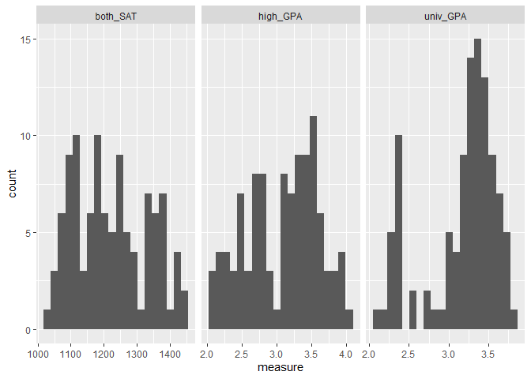

SAT and College Grades
================
Sreenidhi Chalimadugu
2023-04-19

- [Grading Rubric](#grading-rubric)
  - [Individual](#individual)
  - [Due Date](#due-date)
- [Obtain the Data](#obtain-the-data)
  - [**q1** Visit the SAT and College GPA case study page, scroll to the
    bottom, and click the `Open Data with Excel` button. This will allow
    you to download an `xls` file. Save the file to your `data` folder,
    load the data as `df_sat`, and perform your “first checks” against
    these data. Answer the questions
    below:](#q1-visit-the-sat-and-college-gpa-case-study-page-scroll-to-the-bottom-and-click-the-open-data-with-excel-button-this-will-allow-you-to-download-an-xls-file-save-the-file-to-your-data-folder-load-the-data-as-df_sat-and-perform-your-first-checks-against-these-data-answer-the-questions-below)
- [Analysis with Hypothesis Testing](#analysis-with-hypothesis-testing)
  - [View 1: Correlations](#view-1-correlations)
    - [**q2** Create a *single* plot that shows `univ_GPA` against
      *both* `high_GPA` and `both_SAT`. Visually compare the two
      trends.](#q2-create-a-single-plot-that-shows-univ_gpa-against-both-high_gpa-and-both_sat-visually-compare-the-two-trends)
    - [Hypothesis Testing with a Correlation
      Coefficient](#hypothesis-testing-with-a-correlation-coefficient)
    - [**q3** Plot histograms for `both_SAT, high_GPA, univ_GPA`.
      Which—if any—of the variables look approximately normally
      distributed.](#q3-plot-histograms-for-both_sat-high_gpa-univ_gpa-whichif-anyof-the-variables-look-approximately-normally-distributed)
    - [**q4** Use the function `cor.test()` to construct confidence
      intervals for `corr[high_GPA, univ_GPA` and
      `corr[both_SAT, univ_GPA]`. Answer the questions
      below.](#q4-use-the-function-cortest-to-construct-confidence-intervals-for-corrhigh_gpa-univ_gpa-and-corrboth_sat-univ_gpa-answer-the-questions-below)
    - [**q5** Use the bootstrap to approximate a confidence interval for
      `corr[high_GPA, univ_GPA`. Compare your results—both the estimate
      and confidence interval—to your results from
      q4.](#q5-use-the-bootstrap-to-approximate-a-confidence-interval-for-corrhigh_gpa-univ_gpa-compare-your-resultsboth-the-estimate-and-confidence-intervalto-your-results-from-q4)
  - [View 2: Modeling](#view-2-modeling)
    - [Hypothesis Testing with a
      Model](#hypothesis-testing-with-a-model)
    - [**q6** Fit a linear model predicting `univ_GPA` with the
      predictor `both_SAT`. Assess the model to determine how effective
      a predictor `both_SAT` is for `univ_GPA`. Interpret the resulting
      confidence interval for the coefficient on
      `both_SAT`.](#q6-fit-a-linear-model-predicting-univ_gpa-with-the-predictor-both_sat-assess-the-model-to-determine-how-effective-a-predictor-both_sat-is-for-univ_gpa-interpret-the-resulting-confidence-interval-for-the-coefficient-on-both_sat)
    - [**q7** Fit a model predicting `univ_GPA` using both `high_GPA`
      and `both_SAT`. Compare the prediction accuracy and hypothesis
      test
      results.](#q7-fit-a-model-predicting-univ_gpa-using-both-high_gpa-and-both_sat-compare-the-prediction-accuracy-and-hypothesis-test-results)
  - [Synthesize](#synthesize)
    - [**q8** Using the results from all previous q’s, answer the
      following
      questions.](#q8-using-the-results-from-all-previous-qs-answer-the-following-questions)
- [End Notes](#end-notes)

*Purpose*: How do we apply hypothesis testing to investigating data? In
this challenge you’ll practice using hypothesis testing tools to make
sense of a dataset.

*Reading*: - [Harvard Study Says SATs Should Be Optional: Here’s
Why](https://www.csmonitor.com/USA/USA-Update/2016/0120/Harvard-study-says-SATs-should-be-optional.-Here-s-why)
(Optional); easy-to-read news article on colleges going SAT-free -
[Norm-Referenced Tests and Race-Blind
Admissions](https://cshe.berkeley.edu/publications/norm-referenced-tests-and-race-blind-admissions-case-eliminating-sat-and-act-university)
(Optional); technical report on relationship between the SAT/ACT and
non-academic factors

*Credit*: This is based on a [case
study](http://onlinestatbook.com/2/case_studies/sat.html) originally
prepared by Emily Zitek, with data collected through the research of
Thomas MacFarland.

``` r
library(tidyverse)
```

    ## ── Attaching packages ─────────────────────────────────────── tidyverse 1.3.2 ──
    ## ✔ ggplot2 3.4.0      ✔ purrr   0.3.5 
    ## ✔ tibble  3.1.8      ✔ dplyr   1.0.10
    ## ✔ tidyr   1.2.1      ✔ stringr 1.4.1 
    ## ✔ readr   2.1.3      ✔ forcats 0.5.2 
    ## ── Conflicts ────────────────────────────────────────── tidyverse_conflicts() ──
    ## ✖ dplyr::filter() masks stats::filter()
    ## ✖ dplyr::lag()    masks stats::lag()

``` r
library(readxl)
library(broom)
library(modelr)
```

    ## 
    ## Attaching package: 'modelr'
    ## 
    ## The following object is masked from 'package:broom':
    ## 
    ##     bootstrap

``` r
library(rsample)
```

<!-- include-rubric -->

# Grading Rubric

<!-- -------------------------------------------------- -->

Unlike exercises, **challenges will be graded**. The following rubrics
define how you will be graded, both on an individual and team basis.

## Individual

<!-- ------------------------- -->

| Category    | Needs Improvement                                                                                                | Satisfactory                                                                                                               |
|-------------|------------------------------------------------------------------------------------------------------------------|----------------------------------------------------------------------------------------------------------------------------|
| Effort      | Some task **q**’s left unattempted                                                                               | All task **q**’s attempted                                                                                                 |
| Observed    | Did not document observations, or observations incorrect                                                         | Documented correct observations based on analysis                                                                          |
| Supported   | Some observations not clearly supported by analysis                                                              | All observations clearly supported by analysis (table, graph, etc.)                                                        |
| Assessed    | Observations include claims not supported by the data, or reflect a level of certainty not warranted by the data | Observations are appropriately qualified by the quality & relevance of the data and (in)conclusiveness of the support      |
| Specified   | Uses the phrase “more data are necessary” without clarification                                                  | Any statement that “more data are necessary” specifies which *specific* data are needed to answer what *specific* question |
| Code Styled | Violations of the [style guide](https://style.tidyverse.org/) hinder readability                                 | Code sufficiently close to the [style guide](https://style.tidyverse.org/)                                                 |

## Due Date

<!-- ------------------------- -->

All the deliverables stated in the rubrics above are due **at midnight**
before the day of the class discussion of the challenge. See the
[Syllabus](https://docs.google.com/document/d/1qeP6DUS8Djq_A0HMllMqsSqX3a9dbcx1/edit?usp=sharing&ouid=110386251748498665069&rtpof=true&sd=true)
for more information.

*Background*: Every year about 2 million students take the Scholastic
Aptitude Test (SAT). The exam is
[controversial](http://www.nea.org/home/73288.htm) but [extremely
consequential](https://www.csmonitor.com/2004/0518/p13s01-legn.html).
There are many claims about the SAT, but we’re going to look at just
one: Is the SAT predictive of scholastic performance in college? It
turns out this is a fairly complicated question to assess—we’ll get an
introduction to some of the complexities.

# Obtain the Data

<!-- -------------------------------------------------- -->

### **q1** Visit the [SAT and College GPA](http://onlinestatbook.com/2/case_studies/sat.html) case study page, scroll to the bottom, and click the `Open Data with Excel` button. This will allow you to download an `xls` file. Save the file to your `data` folder, load the data as `df_sat`, and perform your “first checks” against these data. Answer the questions below:

``` r
## TODO:
df_sat <- read_excel("data/sat.xls")

## TODO: Do your "first checks"
df_sat %>% 
  glimpse()
```

    ## Rows: 105
    ## Columns: 5
    ## $ high_GPA <dbl> 3.45, 2.78, 2.52, 3.67, 3.24, 2.10, 2.82, 2.36, 2.42, 3.51, 3…
    ## $ math_SAT <dbl> 643, 558, 583, 685, 592, 562, 573, 559, 552, 617, 684, 568, 6…
    ## $ verb_SAT <dbl> 589, 512, 503, 602, 538, 486, 548, 536, 583, 591, 649, 592, 5…
    ## $ comp_GPA <dbl> 3.76, 2.87, 2.54, 3.83, 3.29, 2.64, 2.86, 2.03, 2.81, 3.41, 3…
    ## $ univ_GPA <dbl> 3.52, 2.91, 2.40, 3.47, 3.47, 2.37, 2.40, 2.24, 3.02, 3.32, 3…

**Observations**:

- Fill in the following “data dictionary”

| Column     | Meaning                             |
|------------|-------------------------------------|
| `high_GPA` | high school GPA of a student        |
| `math_SAT` | math SAT score of a student         |
| `verb_SAT` | verbal SAT score of a student       |
| `comp_GPA` | computer science GPA of a student   |
| `univ_GPA` | overall university GPA of a student |

- What information do we have about these students?
  - We have the student grades from high school, SAT scores, and grades
    from university.
- What kinds of information *do we not have* about these students?
  - We do not have any other performance metrics besides these GPAs and
    SAT scores, and we are also missing demographic information.
- Based on these missing variables, what possible effects could be
  present in the data that we would have *no way of detecting*?
  - Based on these missing variables, we have no way of detecting if the
    sample is biased or if there are other variables at play that affect
    the information we are presented.

# Analysis with Hypothesis Testing

<!-- ----------------------------------------------------------------------- -->

We’re going to use two complementary approaches to analyze the data, the
first based on hypothesis testing of correlation coefficients, and the
second based on fitting a regression model and interpreting the
regression coefficients.

To simplify the analysis, let’s look at a composite SAT score:

``` r
## NOTE: No need to edit this
df_composite <-
  df_sat %>%
  mutate(both_SAT = math_SAT + verb_SAT)

df_composite
```

    ## # A tibble: 105 × 6
    ##    high_GPA math_SAT verb_SAT comp_GPA univ_GPA both_SAT
    ##       <dbl>    <dbl>    <dbl>    <dbl>    <dbl>    <dbl>
    ##  1     3.45      643      589     3.76     3.52     1232
    ##  2     2.78      558      512     2.87     2.91     1070
    ##  3     2.52      583      503     2.54     2.4      1086
    ##  4     3.67      685      602     3.83     3.47     1287
    ##  5     3.24      592      538     3.29     3.47     1130
    ##  6     2.1       562      486     2.64     2.37     1048
    ##  7     2.82      573      548     2.86     2.4      1121
    ##  8     2.36      559      536     2.03     2.24     1095
    ##  9     2.42      552      583     2.81     3.02     1135
    ## 10     3.51      617      591     3.41     3.32     1208
    ## # … with 95 more rows

## View 1: Correlations

<!-- ----------------------------------------------------------------------- -->

### **q2** Create a *single* plot that shows `univ_GPA` against *both* `high_GPA` and `both_SAT`. Visually compare the two trends.

*Hint*: One way to do this is to first *pivot* `df_composite`.

``` r
## TODO:
df_composite %>%
  pivot_longer(
    cols = c('high_GPA', 'both_SAT'),
    names_to = 'score_type',
    values_to = 'score' ) %>%
  ggplot(aes(univ_GPA, score)) + 
  geom_point() + 
  facet_grid(rows = vars(score_type), scales = "free")
```

<!-- -->

**Observations**:

- What relationship do `univ_GPA` and `both_SAT` exhibit?
  - There seems to be a positive correlation between univ_GPA and
    both_SAT, especially for university GPAs greater than 3.0.
- What relationship do `univ_GPA` and `high_GPA` exhibit?
  - Similarly, there seems to be a positive correlation between univ_GPA
    and high_SAT, especially for university GPAs greater than 3.0.

### Hypothesis Testing with a Correlation Coefficient

<!-- ------------------------- -->

We can use the idea of hypothesis testing with a correlation
coefficient. The idea is to set our null hypothesis to the case where
there is no correlation, and test to see if the data contradict that
perspective. Formally, the null (H0) and alternative (HA) hypotheses
relating to a correlation coefficient between two variables `X, Y` are:

$$\text{H0: } \text{Corr}[X, Y] = 0$$

$$\text{HA: } \text{Corr}[X, Y] \neq 0$$

The R function `cor.test` implements such a hypothesis test under the
assumption that `X, Y` are both normally distributed. First, let’s check
to see if this assumption looks reasonable for our data.

### **q3** Plot histograms for `both_SAT, high_GPA, univ_GPA`. Which—if any—of the variables look approximately normally distributed.

``` r
df_composite %>% 
  pivot_longer(
    cols = c('high_GPA', 'both_SAT', 'univ_GPA'),
    names_to = "metric",
    values_to = "measure"
  ) %>% 
  ggplot(aes(x = measure)) +
  geom_histogram(bins = 20) +
  facet_grid(~metric, scales = "free")
```

<!-- -->

**Observations**:

- To what extent does `both_SAT` look like a normal distribution?
  - `both_SAT` looks more right skewed than a normal distribution.
- To what extent does `high_GPA` look like a normal distribution?
  - `high_GPA` looks more left skewed than a normal distribution, and
    there is also a large gap in the middle at 3.0 GPA, so it’s not a
    very normal distribution.
- To what extent does `univ_GPA` look like a normal distribution?
  - `univ_GPA` looks very left skewed, as there are many more higher
    GPAs than lower ones.

Keep in mind your findings as you complete q4.

### **q4** Use the function `cor.test()` to construct confidence intervals for `corr[high_GPA, univ_GPA` and `corr[both_SAT, univ_GPA]`. Answer the questions below.

``` r
## TODO: Use the function cor.test() to test the correlations between
##       high_GPA and univ_GPA, as well as between
##       both_SAT and univ_GPA

cor.test(df_composite$high_GPA, df_composite$univ_GPA)
```

    ## 
    ##  Pearson's product-moment correlation
    ## 
    ## data:  df_composite$high_GPA and df_composite$univ_GPA
    ## t = 12.632, df = 103, p-value < 2.2e-16
    ## alternative hypothesis: true correlation is not equal to 0
    ## 95 percent confidence interval:
    ##  0.6911690 0.8449761
    ## sample estimates:
    ##       cor 
    ## 0.7795631

``` r
cor.test(df_composite$both_SAT, df_composite$univ_GPA)
```

    ## 
    ##  Pearson's product-moment correlation
    ## 
    ## data:  df_composite$both_SAT and df_composite$univ_GPA
    ## t = 9.5339, df = 103, p-value = 8.052e-16
    ## alternative hypothesis: true correlation is not equal to 0
    ## 95 percent confidence interval:
    ##  0.5674824 0.7746821
    ## sample estimates:
    ##       cor 
    ## 0.6846776

**Observations**:

- Which correlations are significantly nonzero?
  - Both of the correlations are significantly nonzero (0.78 and 0.68).
- Which of `high_GPA` and `both_SAT` seems to be more strongly
  correlated with `univ_GPA`?
  - `high_GPA` seems to be more strongly correlated with univ_GPA, with
    a correlation coefficient of 0.78, as opposed to that of `both_SAT`
    with 0.68.
- How do the results here compare with the visual you created in q2?
  - The correlation coefficient results make sense with the visual from
    q2, since from the plot it appears that `univ_GPA` is more strongly
    correlated with `high_GPA` and it has less of a scatter overall
    compared to the plot with `both_SAT`.
- Based on these results, what can we say about the predictive
  capabilities of both `high_GPA` and `both_SAT` to predict `univ_GPA`?
  - `high_GPA` can predict `univ_GPA` slightly better than `both_SAT`
    can, since it is more strongly correlated given the higher
    correlation coefficient.

Finally, let’s use the bootstrap to perform the same test using
*different* assumptions.

### **q5** Use the bootstrap to approximate a confidence interval for `corr[high_GPA, univ_GPA`. Compare your results—both the estimate and confidence interval—to your results from q4.

``` r
## TODO: Use the bootstrap to compute a confidence interval for corr[high_GPA, univ_GPA]
n_bootstrap <- 1000

bootstrap_cor <- numeric(n_bootstrap)
for (i in 1:n_bootstrap) {
  sample_id <- sample(length(df_composite$high_GPA), replace = TRUE)
  sample_high_GPA <- df_composite$high_GPA[sample_id]
  sample_univ_GPA <- df_composite$univ_GPA[sample_id]

  bootstrap_cor[i] <- cor(sample_high_GPA, sample_univ_GPA)
}

# Compute confidence interval
lower_conf_interval <- quantile(bootstrap_cor, 0.025)
upper_conf_interval <- quantile(bootstrap_cor, 0.975)
est <- quantile(bootstrap_cor, 0.5)

lower_conf_interval
```

    ##      2.5% 
    ## 0.6925478

``` r
upper_conf_interval
```

    ##     97.5% 
    ## 0.8433458

**Observations**:

- How does your estimate from q5 compare with your estimate from q4?
  - The estimate from q5 is similar to the estimate from q4.
- How does your CI from q5 compare with your CI from q4?
  - The confidence interval is the same.

*Aside*: When you use two different approximations to compute the same
quantity and get similar results, that’s an *encouraging sign*. Such an
outcome lends a bit more credibility to the results.

## View 2: Modeling

<!-- ------------------------- -->

Correlations are useful for relating two variables at a time. To study
the relationship among more variables we can instead use a fitted model.
Using a model, we can also help assess whether it is *worthwhile* to
measure a variable.

To begin, let’s first split the data into training and validation sets.

``` r
## NOTE: No need to edit
set.seed(101)

df_train <-
  df_composite %>%
  rowid_to_column() %>%
  slice_sample(n = 80)

df_validate <-
  df_composite %>%
  rowid_to_column() %>%
  anti_join(
    .,
    df_train,
    by = "rowid"
  )
```

### Hypothesis Testing with a Model

<!-- ------------------------- -->

We can combine the ideas of hypothesis testing with a model. Using a
model, we can express our hypotheses in terms of the model parameters.
For instance, if we were interested in whether $X$ has an affect on $Y$,
we might set up a model:

$$Y_i = \beta X_i + \epsilon_i$$

With the hypotheses:

$$\text{H0}: \beta = 0$$

$$\text{HA}: \beta \neq 0$$

In this case, we’re testing for whether $X$ has a significant effect on
$Y$. Let’s apply this idea to relating the variables `univ_GPA` and
`high_GPA`. Luckily R has built-in tools to construct a confidence
interval on the $\beta$’s in a regression \[1\]; we’ll simply use those
tools rather than do it by hand.

### **q6** Fit a linear model predicting `univ_GPA` with the predictor `both_SAT`. Assess the model to determine how effective a predictor `both_SAT` is for `univ_GPA`. Interpret the resulting confidence interval for the coefficient on `both_SAT`.

``` r
## TODO: Fit a model of univ_GPA on the predictor both_SAT
fit_basic <-
  df_composite %>% 
  lm(formula = univ_GPA ~ both_SAT)

## NOTE: The following computes confidence intervals on regression coefficients
fit_basic %>%
  tidy(
    conf.int = TRUE,
    conf.level = 0.99
  )
```

    ## # A tibble: 2 × 7
    ##   term        estimate std.error statistic  p.value conf.low conf.high
    ##   <chr>          <dbl>     <dbl>     <dbl>    <dbl>    <dbl>     <dbl>
    ## 1 (Intercept) -0.172    0.352       -0.487 6.27e- 1 -1.10      0.753  
    ## 2 both_SAT     0.00274  0.000287     9.53  8.05e-16  0.00198   0.00349

**Observations**:

- What is the confidence interval on the coefficient of `both_SAT`? Is
  this coefficient significantly different from zero?
  - The confidence interval is around 0.0020 to 0.0035, which is
    significantly different from zero, since it does not actually
    include zero.
- By itself, how well does `both_SAT` predict `univ_GPA`?
  - It can provide a general prediction that with a higher SAT there
    will be a higher GPA, but this is not a very strong correlation.

Remember from `e-model03-interp-warnings` that there are challenges with
interpreting regression coefficients! Let’s investigate that idea
further.

### **q7** Fit a model predicting `univ_GPA` using both `high_GPA` and `both_SAT`. Compare the prediction accuracy and hypothesis test results.

``` r
## TODO: Fit and assess models with predictors both_SAT + high_GPA, and high_GPA alone
df_composite %>% 
  lm(formula = univ_GPA ~ high_GPA + both_SAT) %>% 
  tidy(
    conf.int = TRUE,
    conf.level = 0.99
  )
```

    ## # A tibble: 3 × 7
    ##   term        estimate std.error statistic       p.value  conf.low conf.high
    ##   <chr>          <dbl>     <dbl>     <dbl>         <dbl>     <dbl>     <dbl>
    ## 1 (Intercept) 0.540     0.318         1.70 0.0924        -0.294      1.37   
    ## 2 high_GPA    0.541     0.0837        6.47 0.00000000353  0.322      0.761  
    ## 3 both_SAT    0.000792  0.000387      2.05 0.0432        -0.000224   0.00181

``` r
df_composite %>% 
  lm(formula = univ_GPA ~ high_GPA) %>% 
  tidy(
    conf.int = TRUE,
    conf.level = 0.99
  )
```

    ## # A tibble: 2 × 7
    ##   term        estimate std.error statistic  p.value conf.low conf.high
    ##   <chr>          <dbl>     <dbl>     <dbl>    <dbl>    <dbl>     <dbl>
    ## 1 (Intercept)    1.10     0.167       6.58 1.98e- 9    0.660     1.53 
    ## 2 high_GPA       0.675    0.0534     12.6  1.18e-22    0.535     0.815

**Observations**:

- How well do these models perform, compared to the one you built in q6?
  - Both models perform well.
- What is the confidence interval on the coefficient of `both_SAT` when
  including `high_GPA` as a predictor?? Is this coefficient
  significantly different from zero?
  - The confidence interval here is -0.00022 to 0.0018, which includes
    zero and therefore the coefficient is not significantly different
    from zero.
- How do the hypothesis test results compare with the results in q6?
  - Taking the `high_GPA` into account, `both_SAT` might not be
    positively correlated with academic performance, unlike what the
    results show in q6.

## Synthesize

<!-- ------------------------- -->

Before closing, let’s synthesize a bit from the analyses above.

### **q8** Using the results from all previous q’s, answer the following questions.

**Observations**:

- Between `both_SAT` and `high_GPA`, which single variable would you
  choose to predict `univ_GPA`? Why?
  - Based on the data we have, it seems as though `high_GPA` predicts
    `univ_GPA` better than `both_SAT`, one reason being that is has a
    greater correlation coefficient with `univ_GPA` compared to
    `both_SAT`.
- Is `both_SAT` an effective predictor of `univ_GPA`? What specific
  pieces of evidence do you have in favor of `both_SAT` being effective?
  What specific pieces of evidence do you have against?
  - According to the data, it does not seem like `both_SAT` is an
    effective predictor of `univ_GPA`. Given that there initially seems
    to be a positive correlation between `both_SAT` and `univ_GPA`, it
    might make it seem like it is an effective predictor of `univ_GPA`,
    but taking `high_GPA` into account, `both_SAT` does not positively
    correlate with `univ_GPA`.

# End Notes

<!-- ----------------------------------------------------------------------- -->

\[1\] There are also assumptions underlying this kind of testing, for
more information see this [Wiki
article](https://en.wikipedia.org/wiki/Linear_regression#Assumptions).
